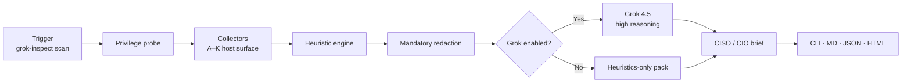

# Grok Inspect

<p align="center">
  
  
  
  
  
</p>

<p align="center">
  <strong>Enterprise-grade host inspection agent</strong> for sniffing surfaces, info-stealing indicators, and related malicious presence — with optional <strong>Grok 4.5</strong> analysis at maximum reasoning via the official SpaceXAI <code>xai-sdk</code>.
</p>

<p align="center">
  <a href="#quick-start">Quick Start</a> ·
  <a href="#operating-modes">Operating Modes</a> ·
  <a href="#executive-reports">Executive Reports</a> ·
  <a href="docs/USER_GUIDE.md">User Guide</a> ·
  <a href="SECURITY.md">Security</a> ·
  <a href="https://github.com/harlockus/grok_inspect">Repository</a>
</p>

---

## At a glance

| Capability | Detail |
|------------|--------|
| **Mission** | On-demand host risk inspection (not continuous EDR) |
| **Platforms** | macOS · Linux · Windows |
| **Intelligence** | Deterministic heuristics + **Grok 4.5** (`reasoning_effort=high`) |
| **Audience** | Operators, IR leads, **CISO / CIO** executive consumers |
| **Outputs** | Terminal · **Markdown** · **JSON** · **HTML** executive brief |
| **Privilege** | **Standard** (user) or **Pro / Elevated** (`sudo` / Administrator) |
| **Safety** | Redaction, `.env`-only keys, no secret dumps, no auto-remediation |

> **Full operator documentation:** [docs/USER_GUIDE.md](docs/USER_GUIDE.md)  
> **Threat model & controls:** [SECURITY.md](SECURITY.md)

---

## Architecture



**Collectors never call Grok.** Heuristics own ground truth. Grok prioritizes, narrates for executives, and produces dual-track actions (leadership + technical).

---

## What it inspects

| Domain | Signals (summary) |
|--------|-------------------|
| **Network** | Listeners, routes, hosts file, proxies, remote access surface |
| **Sniffing** | Capture tools, promisc/monitor, BPF / Npcap, MITM-adjacent hints |
| **Process** | Inventory, LOLBins, masquerade, obfuscated command lines |
| **Persistence** | LaunchAgents, systemd, Run keys, tasks, `ld.so.preload`, … |
| **Stealer risk** | Path/process IoCs, browser-profile metadata (no secret dumps) |
| **Accounts** | Users, SSH/RDP hints, logon samples |
| **Filesystem** | Recent executables, SUID/world-writable hotspots, extensions |
| **Posture** | Firewall / SIP / security feature signals |
| **Logs & USB** | Bounded auth samples; peripheral hints |

**Explicitly out of scope:** live PCAP (see network IDS tools), password/cookie/keychain extraction, automatic kill/quarantine.

---

## Operating modes

### Standard mode (user context)

Fast path for everyday triage. Some collectors run **limited** without elevation — the report states coverage honestly.

```bash
source .venv/bin/activate
grok-inspect scan -v
```

### Pro mode (elevated) — recommended for executive briefs

Maximum collector depth. Use the **venv binary** under `sudo` so root resolves the correct install and project root.

```bash
cd /path/to/grok_inspect

# Pro / elevated scan + Grok CISO brief
sudo .venv/bin/grok-inspect scan -v

# Pro / elevated, heuristics only (no API)
sudo .venv/bin/grok-inspect scan --no-grok -v
```

| | Standard | **Pro (Elevated)** |
|--|----------|---------------------|
| Command | `grok-inspect scan -v` | `sudo .venv/bin/grok-inspect scan -v` |
| Process depth | Best-effort | Stronger multi-user visibility |
| Services / drivers | Partial | Deeper (platform-dependent) |
| Coverage honesty | Yes | Yes — fewer “limited” collectors |
| Windows | User shell | **Run as Administrator** |

**Windows Pro mode:** open PowerShell or Terminal **as Administrator**, activate the venv, then `grok-inspect scan -v`.

---

## Quick start

### 1. Clone & install

```bash
git clone https://github.com/harlockus/grok_inspect.git
cd grok_inspect
bash scripts/install.sh
source .venv/bin/activate          # Windows: .venv\Scripts\activate
```

> **Do not use** `pip install -e .` on **macOS + Python 3.14** — editable installs can produce a hidden `.pth` that Python skips (`ModuleNotFoundError`). Use `scripts/install.sh` or plain `pip install ".[dev]"`.

### 2. Configure SpaceXAI (Grok)

Store the key **only** in project `.env` (gitignored):

```bash
cp .env.example .env
# Edit .env:
#   XAI_API_KEY=xai-your-key-from-https://console.x.ai/
```

```bash
grok-inspect doctor
```

Expected when ready:

```text
XAI_API_KEY: present
Source: loaded from .../grok_inspect/.env
Grok analysis ready for `grok-inspect scan`
```

### 3. Run

```bash
# Standard
grok-inspect scan -v

# Pro (elevated) — macOS / Linux
sudo .venv/bin/grok-inspect scan -v

# Offline / no Grok API
grok-inspect scan --no-grok -v
```

### 4. Open executive reports

| Artifact | Audience |
|----------|----------|
| `reports/latest.html` | **CISO / CIO** — open in browser / print to PDF |
| `reports/latest.md` | Exec + IR shared brief |
| `reports/latest.json` | Automation / SIEM / ticketing |
| Terminal summary | Operator at scan time |

```bash
open reports/latest.html    # macOS
# xdg-open reports/latest.html   # Linux
# start reports/latest.html      # Windows
```

---

## Command reference

| Command | Purpose |
|---------|---------|
| `grok-inspect doctor` | Verify install, project root, `.env`, model (never prints full key) |
| `grok-inspect scan -v` | Full scan; Grok if key present |
| `grok-inspect scan --no-grok -v` | Heuristics only |
| `grok-inspect scan --out DIR` | Custom report directory |
| `grok-inspect scan --allowlist PATH` | Suppress known-good tools |
| `grok-inspect scan --timeout SEC` | Per-collector timeout (5–300) |
| `grok-inspect version` | Version string |
| `sudo .venv/bin/grok-inspect scan -v` | **Pro mode** (elevated) |

### Exit codes

| Code | Meaning |
|------|---------|
| `0` | Clean / info–low only |
| `1` | Medium or high findings |
| `2` | Scan error |
| `3` | Critical findings |

---

## Executive reports (CISO / CIO)

Grok produces a **dual-track** brief when enabled:

1. **Executive layer** — risk rating, business impact, board talking points, **decide & direct** actions (owner, timeline, success criteria)  
2. **Technical layer** — phased detailed steps, verification, related finding IDs, **30 / 60 / 90 day** plan  
3. **Assurance** — coverage assessment, residual risk, assumptions, operator questions  

Heuristic findings remain the ground-truth catalog beneath the executive narrative.

```text
┌─────────────────────────────────────────────────────────┐
│  EXECUTIVE HOST RISK BRIEF                              │
│  Risk · KPI strip · Situation · Business impact         │
├─────────────────────────────────────────────────────────┤
│  EXECUTIVE ACTIONS     │  DETAILED TECHNICAL ACTIONS    │
│  P0–P3 · Owner · SLA   │  Phase · Steps · Verify        │
├─────────────────────────────────────────────────────────┤
│  30 / 60 / 90 · Threat narrative · Full finding catalog │
└─────────────────────────────────────────────────────────┘
```

Model policy: **`grok-4.5`** only, **`reasoning_effort=high`**. No silent mini/fast downgrade. Cost control = `--no-grok` or omit the key.

---

## Configuration

| Item | Location |
|------|----------|
| **API key** | `.env` → `XAI_API_KEY=` (**never** commit) |
| Non-secret defaults | `config/default.yaml` |
| Env template | `.env.example` |
| Allowlist example | `data/allowlist.example.yaml` |
| Optional model override | `.env` → `XAI_MODEL=grok-4.5` |

If both shell export and `.env` set a key, **`.env` wins**.

---

## Secure by design

| Control | Behavior |
|---------|----------|
| API key storage | Project `.env` only; stripped from YAML |
| Redaction | Before Grok **and** before report write |
| Subprocess | `shell=False`; secrets scrubbed from child env |
| Paths | Report writes blocked under system roots |
| YAML | Size-capped `safe_load` |
| Model output | No raw model dump retained in reports |
| Intent | **Read-only inspection** — no kill / quarantine |

Full threat model: **[SECURITY.md](SECURITY.md)**.

---

## Repository layout

```text
grok_inspect/
├── src/grok_inspect/          # Application package
│   ├── collectors/            # OS-aware host collectors
│   ├── heuristics/            # Deterministic rule packs
│   ├── agent/                 # Grok 4.5 CISO analyst (xai-sdk)
│   ├── report/                # MD · JSON · HTML · terminal
│   └── security/              # Redact · sanitize · paths · safe I/O
├── config/default.yaml        # Non-secret defaults
├── data/                      # IoCs + allowlist example
├── docs/
│   ├── USER_GUIDE.md          # Comprehensive operator guide
│   └── superpowers/           # Design & implementation specs
├── scripts/install.sh         # Production-reliable installer
├── tests/                     # Unit suite
├── reports/                   # Scan outputs (gitignored)
├── .env.example
├── SECURITY.md
└── LICENSE
```

---

## Development

```bash
source .venv/bin/activate
pip install .
pytest -q
```

After pulling new commits, reinstall so the console entry point stays current:

```bash
pip install .
# or
bash scripts/install.sh
```

---

## Responsible use

Grok Inspect is for **defensive** assessment of systems you own or are **explicitly authorized** to inspect. Unauthorized use may be unlawful.

## License

[MIT](LICENSE) · Maintained at [github.com/harlockus/grok_inspect](https://github.com/harlockus/grok_inspect)
